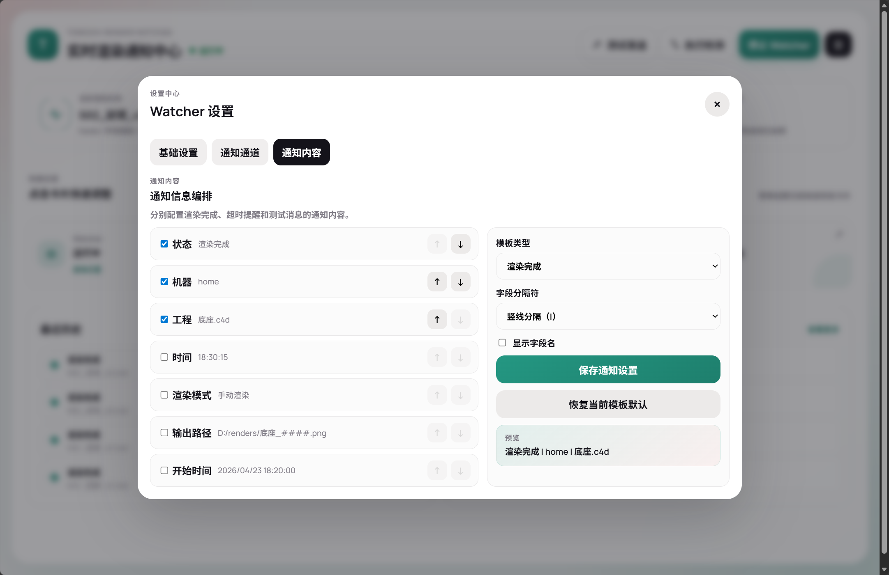

# C4d通知到手机
**_快速使用可以直接跳转到下文[快速开始](#快速开始)_**
# 简介

一个面向 `Cinema 4D` 的渲染通知工具。

它由两部分组成：

- `c4d_render_notifier/`
  - 安装到 `C4D` 的插件
  - 负责检测渲染状态并写入运行信息
- `watcher/`
  - 独立后台 watcher
  - 负责托盘常驻、读取状态、发送通知、提供 Web 控制台

适合解决这类问题：

- `C4D` 渲染完成后没有提醒
- 多台机器渲染时，不容易区分是哪台机器完成
- 希望把渲染完成或超时提醒推送到飞书、Server酱等渠道

发布说明见：

- [RELEASE_NOTES.md](RELEASE_NOTES.md)
- [CHANGELOG.md](CHANGELOG.md)

界面预览：

<table>
   <tr>
      <td></td>
      
   </tr>
</table>
<table>
   <tr>
   <td></td>
      <td></td>
      <td></td>
   </tr>
</table>
## 主要功能

- `C4D` 手动渲染完成通知
- `C4D` 渲染队列完成通知

## 快速开始
我制作了一个详细的视频教程，手把手教您如何完成所有部署步骤。如果您偏爱视频指导，请点击下方链接观看：

*点击图片跳转B站观看[完整视频](https://www.bilibili.com/video/BV1RNRKB1ES1/)*

### 1. 安装 C4D 插件

把：

- `Tongzhi-Render-Notifier`复制到自己的插件目录：`C:\Program Files\Maxon Cinema 4D 2025\plugins\`
- 当前测试版本是 `2025.3.1`，可以正常运行

### 2. 启动 watcher

发布版可直接运行：

- `C:\Program Files\Maxon Cinema 4D 2025\plugins\Tongzhi-Render-Notifier\watcher\TongzhiWatcher.exe`

启动后它会：

- 静默运行后台 watcher
- 启动托盘图标
- 自动打开浏览器控制台

### 3. 配置通知

#### 3.1 关于通知

  
飞书 webhook（推荐指数：⭐⭐⭐⭐⭐）

  内容

  - 配置最简单，IOS，安卓通用

  配置界面：

  点击创建群组 -> 点击群设置 -> 添加群机器人 -> 添加机器人 -> 自定义机器人 -> 点击添加，这时候就会有链接出现。

  

  这里选择 `feishu webhook`，直接复制链接到配置界面，保存设置就可以了。
  

  
Server酱（推荐指数：⭐⭐⭐⭐）

  - 免费版有一些限制，喜欢微信通知可以用这个配置，需要轻微折腾
  - 官网：[https://sct.ftqq.com/](https://sct.ftqq.com/)
  - 推荐指数：⭐⭐⭐⭐

  同样只需要复制 API Key 就可以收到通知。

  
 Slack（推荐指数：⭐⭐⭐）

  - 官网:[https://sct.ftqq.com/](https://sct.ftqq.com/)
  - ios用户体验比较好，自行测试

    在 Slack 应用中启用 Incoming Webhooks，复制工作区生成的 Webhook 地址，在通道类型中选择 `Slack Webhook`。

  
Gotify（推荐指数：⭐⭐⭐⭐）

  - 官网:[https://gotify.net/](https://gotify.net/)
  - 推荐指数：⭐⭐⭐⭐

    在 Gotify 中创建应用并取得 Token，在通道类型中选择 `Gotify`，填写完整消息地址，例如 `https://gotify.example/message?token=...`。

## 配置文件位置

程序默认读取：

`%APPDATA%\TongzhiRenderNotifier\`

主要文件：

- `tongzhi_render_notifier.json`# 主配置文件
- `runtime_state.json`#插件写入的实时渲染状态
- `plugin.log`#插件日志
- `watcher.log`#watcher 日志
- `notify_history.json`#通知历史

如果要迁移到另一台电脑，请重点复制：

`%APPDATA%\TongzhiRenderNotifier\tongzhi_render_notifier.json`

## 一点感受

AI 时代最笨的是人。一个下午慢悠悠就写好了功能，又一个半天套了一个好看的 Web UI，满足了自己码农的小心愿。
